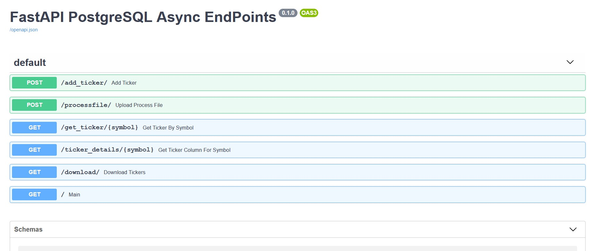

#  Async Multiprocessing Data Pipeline REST endpoints
> ## Using FastAPI and Postgres in less than 48 hours
> My first usecase working with Postgres, async and FastAPI

Design choices:
- Chosen FastAPI as it's an async framework and also comes with automatic interactive documentation.
- Postgres as DB
- Sqlalchemy as ORM

Implemented REST End points to 
- [x] Add a ticker record
- [x] Upload ticker records from json file
- [x] Get 1(n) ticker records based on symbol
- [x] Get specific values for 1(n) ticker records filtered based on symbol and keyword
- [x] Download n(all) ticker records in the database
- [ ] Update ticker record based on id
- [ ] Modify specific value for a particular ticker record based on id

---

## Setup in local machine

```
cd CurlHg_API

python -m venv CurlHg

Windows: .\CurlHg\Scripts\activate

Linux: source .\CurlHg\Scripts\activate

pip install -r requirements.txt


uvicorn --port 8000 --host 127.0.0.1 tickers_app.main:app --reload

```

PS: Requires Python 3.7 or above, or in Python 3.6, install the "backports" using `pip install async-exit-stack async-generator`


    Access UI using `http://127.0.0.1:8000/docs`



    Alternatively File can also be upload using basic UI at `http://127.0.0.1:8000/`


Areas to work on :
- remaining endpoints
- input validations 
- increase async coverage
- increase documentation
